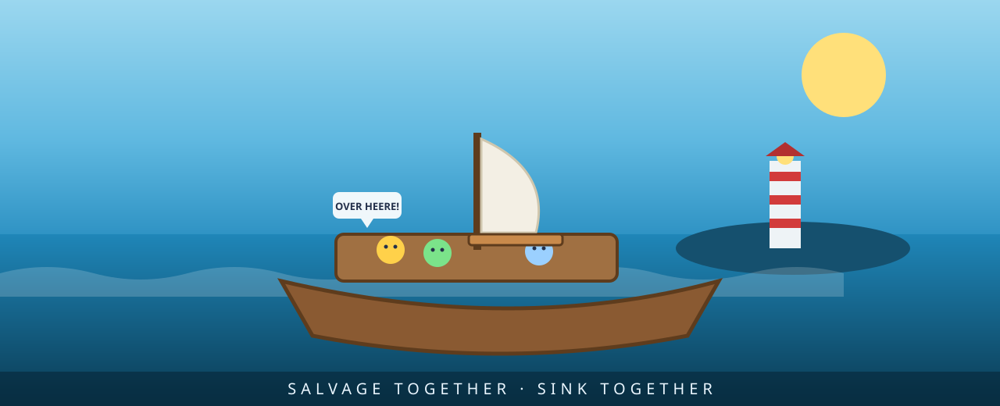

<!-- key art -->

<h1 align="center">SLOOP TROOP</h1>

<b>Salvage together. Sink together.</b> 
A cheap, chaotic, <i>constructive</i> co-op comedy — 2–6 friends crew one leaky sloop and rebuild a sunken archipelago.

---

> **Studio niche pick #2 for 2026–2027 — Constructive, non-horror cooperative ("friendslop").**
> Chosen via the studio's research → critic-cycle → design pipeline. Full sourcing in
> [`docs/MARKET_VALIDATION.md`](docs/MARKET_VALIDATION.md).

## Why this game

Co-op is the most **under-supplied-vs-demand** category on Steam — ~6% of releases but ~36–46% of units sold,
and **~$8.2B gross on Steam in 2025**. But the breakout hits cluster in **horror / extraction / chaos**, and
PEAK (10M+ copies, non-horror) plus open player fatigue with scare-reliant co-op prove the **constructive,
build-together** lane is wide open. Sloop Troop claims it: same cheap price, same proximity-voice slapstick —
but the point is to **rebuild a world together**, not survive a monster.

**The hook:** physics + co-carry + proximity voice generate the comedy (six people moving one awkward beam),
the **Swell** director guarantees set-piece chaos, and a visible **constructive goal** makes every expedition
feel like progress. Wholesome chaos, not horror chaos.

## What's in this repo

| Path | What |
|---|---|
| [`GDD.md`](GDD.md) | Full Game Design Document |
| [`docs/MARKET_VALIDATION.md`](docs/MARKET_VALIDATION.md) | Sources, traction signals, and the 10→2 critic-cycle log |
| [`prototype/index.html`](prototype/index.html) | **Self-contained** HTML5 Canvas prototype of the salvage → trim → build loop, with AI crew + proximity-voice callouts (open in any browser — zero dependencies) |
| [`unity/`](unity/) | Unity **6000.4.4f1 + Netcode for GameObjects** project: folder layout, core C# systems, scene manifest, prefab specs, onboarding README |
| [`branding/`](branding/) | Logo + key-art (SVG) |

## Run the prototype

Open `prototype/index.html` in any modern browser. Press **Cast off**, then:
`WASD`/arrows move · `E` grab salvage / drop on the Build Pad · `Space` yell (call a deckhand to co-carry a heavy beam).
Haul salvage to rebuild the lighthouse — but don't let loose cargo pile up and capsize the trim, and brace for the **Swell**.

## Open the Unity project

Unity Hub → Add → `unity/` → open with **6000.4.4f1**. See [`unity/README.md`](unity/README.md) for the netcode
model and [`unity/ProjectStructure.md`](unity/ProjectStructure.md) for the scene manifest and prefab specs.

## Status

Concept + networked vertical-slice scaffold. Next: author `Harbor.unity`, wire server-authoritative co-carry,
and ship a Steam Next Fest demo with Workshop support to seed the modding flywheel.

---
Built by the Abdulmalek Agents virtual game studio. Market figures are directional, from public 2023–2026 sources; re-pull at green-light.
